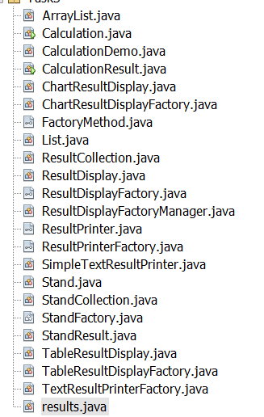

# 34_Umanets_Oleksandr
- [**Task1**](https://github.com/Chuda4ok/34_Umanets_Oleksandr#task1)
- [**Task2**](https://github.com/Chuda4ok/34_Umanets_Oleksandr#task2)
- [**Task3**](https://github.com/Chuda4ok/34_Umanets_Oleksandr#task3)
- [**Task4**](https://github.com/Chuda4ok/34_Umanets_Oleksandr#task4)
- [**Task5**](https://github.com/Chuda4ok/34_Umanets_Oleksandr#task5)
- [**Task6**](https://github.com/Chuda4ok/34_Umanets_Oleksandr#task6)
# Task1
Завдання:

Написати просту консольну програму (наприклад вивід на екран аргументів командної строки)

**Результат виконання програми** 

# Task2
Завдання:

№21 - Визначити двійкове уявлення цілої та дробової частини речового
десяткового числа

**Результат виконання програми** 

# Task3
Завдання:

1. Використовуючи шаблон проектування Factory Method (Virtual Constructor), розробити ієрархію, що передбачає розширення рахунок додавання
нових відображуваних класів.
2. Розширити ієрархію інтерфейсом "фабрикованих" об'єктів, що представляє набір методів для відображення результатів обчислень.
3. Реалізувати ці методи виведення результатів у текстовому виде.
4. Розробити тареалізувати інтерфейс для "фабрикуючого" методу

**Результат виконання програми** 

# Task4
Завдання:

1. За основу використовувати вихідний текст проекту попередньої лабораторної роботи Використовуючи шаблон проектування Factory Method 
(Virtual Constructor), розширити ієрархію похідними класами, реалізують методи для подання результатів у вигляді текстової
таблиці. Параметри відображення таблиці мають визначатися користувачем.
2. Продемонструвати заміщення (перевизначення, overriding), поєднання (перевантаження, overloading), динамічне призначення методів
3. Забезпечити діалоговий інтерфейс із користувачем.
4. Розробити клас для тестування основної функціональності.
5. Використати коментарі для автоматичної генерації документації засобами javadoc.

**Результат виконання програми** 
 

# Task5
Завдання:

1. Реалізувати можливість скасування (undo) операцій (команд).
2. Продемонструвати поняття "макрокоманда"
3. При розробці програми використовувати шаблон Singletone.
4. Забезпечити діалоговий інтерфейс із користувачем.
5. Розробити клас для тестування функціональності програми.

**Результат виконання програми** 

# Task1
Завдання:

1. Продемонструвати можливість паралельної обробки елементів колекції (пошук мінімуму, максимуму, обчислення середнього значення, відбір за критерієм, статистична обробка тощо).
2. Управління чергою завдань (команд) реалізувати за допомогою шаблону Worker Thread.

**Результат виконання програми** 

